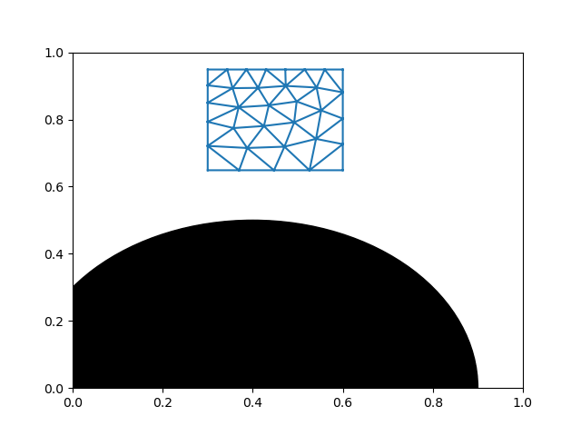
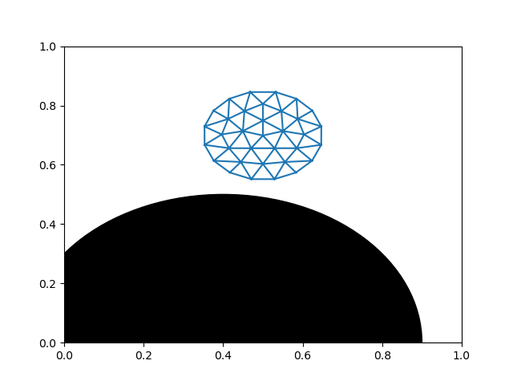

## Multiphysics Modelling of DNA Nanorobots

This repository documents my work done as part of USyd's [Engineering Vacation Research Internship Program](https://www.sydney.edu.au/engineering/study/scholarships/engineering-vacation-research-internship-program.html) from January to March 2022. The project I was part of involved building, testing, and refining a model to simulate the rolling adhesion behaviour of leukocytes using the open-source modelling software OpenFOAM. This will eventually enable the design of DNA origami-based nanorobots that can act as synthetic leukocytes to identify early-stage atherosclerotic plaques for early diagnosis and targeted treatment of cardiovascular disease.

### Dependencies

For mesh generation: MeshGenC++ ([installation instructions](http://www.dogpack-code.org/MeshGenC++/install.html#dependencies))

[This](http://www.qhull.org/README.txt) page may be useful while setting up qhull within MeshGenC++ as mentioned in the previously linked page.

After successful installation of MeshGenC++, the bash script that contains the newly defined environment variables for this library may need to be re-sourced for every new terminal session.

The code that updates the state of the mesh has no dependencies outside of STL.

### Running instructions

First, generate the mesh using meshgencpp (see an example of how to [here](http://www.dogpack-code.org/MeshGenC++/install.html)). Store the resulting folder in this directory. 

E.g. the square and circle folders present in this directory currently are such resulting folders. To modify e.g. the circle mesh, the grid spacing can be modified in line 2 of circle/input2D.data, and the initial centre/radius specification of the circle can be modified by changing the values used in the circle/SignedDistance.cpp file. To regenerate the mesh after modifying these, run <code>make clean</code> followed by <code>make</code> inside the circle folder (this will require meshgencpp to be installed).

In fem.h, change the parameter passed to init_mesh in line 50 such that it corresponds to the relative path of the folder generated in the previous step.

To run the simulation: execute <code>g++ simul.cpp</code> followed by <code>./a.out</code>
The number of steps N considered can be changed by modifying the upper limit of n in the for loop in line 7 of simul.cpp.

Running the above will save some information about the state of the mesh after each iteration in the 'states' folder in this directory.

To visualize these changing states after each iteration, run <code>python3 vizstate.py N</code> where N is the total number of steps considered in line 7 of simul.cpp. A file output.gif will be generated and stored in this directory.

### Examples of output

Square mesh                 |  Circular mesh
:-------------------------:|:-------------------------:
  |  

